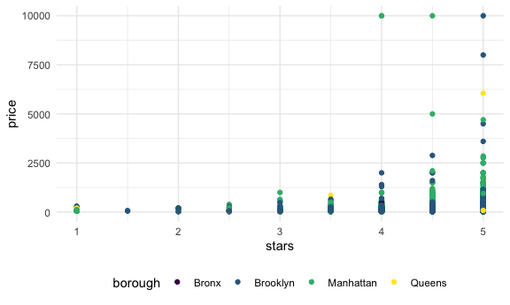
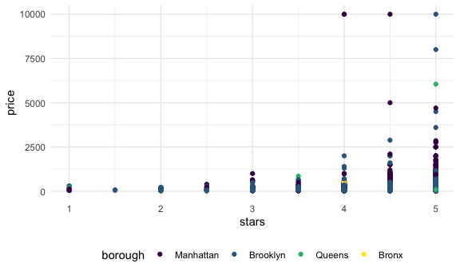
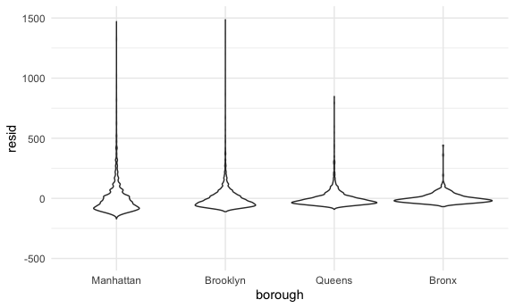
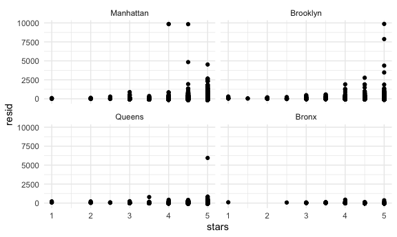

Linear models
================

## Import data

``` r
data("nyc_airbnb")

nyc_airbnb = 
  nyc_airbnb %>% 
  mutate(stars = review_scores_location / 2) %>% 
  rename(
    borough = neighbourhood_group,
    neighborhood = neighbourhood
  ) %>% 
  filter(
    borough != "Staten Island"
  ) %>% 
  select(price, stars, borough, neighborhood, room_type)
```

## Fit a model

``` r
#main interest: price as outcome and star rating and borough as predictors.

nyc_airbnb %>% 
  ggplot(aes(x = stars, y = price, color = borough)) +
  geom_point()
```

    ## Warning: Removed 9962 rows containing missing values (geom_point).



Let’s fit the model we care about.

``` r
fit = lm(price ~ stars + borough, data = nyc_airbnb)
```

Let’s look at the result…

Let’s look at the result better ..

``` r
broom::glance(fit)
```

    ## # A tibble: 1 x 12
    ##   r.squared adj.r.squared sigma statistic   p.value    df  logLik    AIC    BIC
    ##       <dbl>         <dbl> <dbl>     <dbl>     <dbl> <dbl>   <dbl>  <dbl>  <dbl>
    ## 1    0.0342        0.0341  182.      271. 6.73e-229     4 -2.02e5 4.04e5 4.04e5
    ## # … with 3 more variables: deviance <dbl>, df.residual <int>, nobs <int>

``` r
#output is a dataframe! a tibble

broom::tidy(fit)
```

    ## # A tibble: 5 x 5
    ##   term             estimate std.error statistic  p.value
    ##   <chr>               <dbl>     <dbl>     <dbl>    <dbl>
    ## 1 (Intercept)         -70.4     14.0      -5.02 5.14e- 7
    ## 2 stars                32.0      2.53     12.7  1.27e-36
    ## 3 boroughBrooklyn      40.5      8.56      4.73 2.23e- 6
    ## 4 boroughManhattan     90.3      8.57     10.5  6.64e-26
    ## 5 boroughQueens        13.2      9.06      1.46 1.45e- 1

``` r
#nicely structed dataframe

broom::tidy(fit) %>% 
  select(-std.error, -statistic) %>% 
  mutate(
    term = str_replace(term, "borough", "Borough: ")
  ) %>% 
  knitr::kable(digits = 3)
```

| term               | estimate | p.value |
| :----------------- | -------: | ------: |
| (Intercept)        | \-70.414 |   0.000 |
| stars              |   31.990 |   0.000 |
| Borough: Brooklyn  |   40.500 |   0.000 |
| Borough: Manhattan |   90.254 |   0.000 |
| Borough: Queens    |   13.206 |   0.145 |

## Be in control of factors

``` r
#In R, character variable is converted into factor (and makes certain assumptions the best it can).  For example, Bronx is the reference group set automatically by R based on alphabetical order.

#What if I wanted to make reference category something specific?

nyc_airbnb =
  nyc_airbnb %>% 
  mutate(
    borough = fct_infreq(borough),
    room_type = fct_infreq(room_type)
  )

#the above factor infreq order changes the reference group such that the borough with the most observations is the reference group: "fct_infreq(): by number of observations with each level (largest first)"
```

Look at that plot again

``` r
nyc_airbnb %>% 
  ggplot(aes(x = stars, y = price, color = borough)) +
  geom_point()
```

    ## Warning: Removed 9962 rows containing missing values (geom_point).



``` r
fit = lm(price ~ stars + borough, data = nyc_airbnb)

broom::tidy(fit)
```

    ## # A tibble: 5 x 5
    ##   term            estimate std.error statistic   p.value
    ##   <chr>              <dbl>     <dbl>     <dbl>     <dbl>
    ## 1 (Intercept)         19.8     12.2       1.63 1.04e-  1
    ## 2 stars               32.0      2.53     12.7  1.27e- 36
    ## 3 boroughBrooklyn    -49.8      2.23    -22.3  6.32e-109
    ## 4 boroughQueens      -77.0      3.73    -20.7  2.58e- 94
    ## 5 boroughBronx       -90.3      8.57    -10.5  6.64e- 26

``` r
broom::glance(fit)
```

    ## # A tibble: 1 x 12
    ##   r.squared adj.r.squared sigma statistic   p.value    df  logLik    AIC    BIC
    ##       <dbl>         <dbl> <dbl>     <dbl>     <dbl> <dbl>   <dbl>  <dbl>  <dbl>
    ## 1    0.0342        0.0341  182.      271. 6.73e-229     4 -2.02e5 4.04e5 4.04e5
    ## # … with 3 more variables: deviance <dbl>, df.residual <int>, nobs <int>

``` r
#model hasn't changed in fundamental way - just changed the reference group)
```

## Diagnostics

``` r
nyc_airbnb %>% 
  modelr::add_residuals(fit) %>% 
  ggplot(aes(x = borough, y = resid)) +
  geom_violin() +
  ylim(-500, 1500)
```

    ## Warning: Removed 9993 rows containing non-finite values (stat_ydensity).



``` r
nyc_airbnb %>% 
  modelr::add_residuals(fit) %>% 
  ggplot(aes(x = stars, y = resid)) + 
  geom_point() +
  facet_wrap(. ~ borough)
```

    ## Warning: Removed 9962 rows containing missing values (geom_point).



``` r
nyc_airbnb %>% 
  filter(
    borough == "Queens",
    price > 500
  ) 
```

    ## # A tibble: 20 x 5
    ##    price stars borough neighborhood     room_type      
    ##    <dbl> <dbl> <fct>   <chr>            <fct>          
    ##  1   850   3.5 Queens  Astoria          Entire home/apt
    ##  2   585  NA   Queens  Astoria          Private room   
    ##  3  1000  NA   Queens  Briarwood        Entire home/apt
    ##  4  1100  NA   Queens  Briarwood        Private room   
    ##  5   700   5   Queens  East Elmhurst    Private room   
    ##  6  6050   5   Queens  East Elmhurst    Private room   
    ##  7   750  NA   Queens  Jamaica Estates  Private room   
    ##  8   895   5   Queens  Flushing         Entire home/apt
    ##  9  1000  NA   Queens  Flushing         Private room   
    ## 10   950   5   Queens  Flushing         Entire home/apt
    ## 11   599  NA   Queens  Flushing         Entire home/apt
    ## 12   550   5   Queens  Forest Hills     Entire home/apt
    ## 13   599  NA   Queens  Glendale         Entire home/apt
    ## 14   650   5   Queens  Long Island City Entire home/apt
    ## 15   750  NA   Queens  Ridgewood        Entire home/apt
    ## 16   600  NA   Queens  Rockaway Beach   Entire home/apt
    ## 17   600  NA   Queens  St. Albans       Entire home/apt
    ## 18   600  NA   Queens  Sunnyside        Entire home/apt
    ## 19   540   5   Queens  Sunnyside        Entire home/apt
    ## 20   580   5   Queens  Sunnyside        Entire home/apt

## Hypothesis tests

This does t-test by default

``` r
fit %>% 
  broom::tidy()
```

    ## # A tibble: 5 x 5
    ##   term            estimate std.error statistic   p.value
    ##   <chr>              <dbl>     <dbl>     <dbl>     <dbl>
    ## 1 (Intercept)         19.8     12.2       1.63 1.04e-  1
    ## 2 stars               32.0      2.53     12.7  1.27e- 36
    ## 3 boroughBrooklyn    -49.8      2.23    -22.3  6.32e-109
    ## 4 boroughQueens      -77.0      3.73    -20.7  2.58e- 94
    ## 5 boroughBronx       -90.3      8.57    -10.5  6.64e- 26

What about the significance of `borough`

``` r
fit_null = lm(price ~ stars, data = nyc_airbnb)
fit_alt = lm(price ~ stars + borough, data = nyc_airbnb)

anova(fit_null, fit_alt) %>% 
  broom::tidy()
```

    ## # A tibble: 2 x 6
    ##   res.df         rss    df     sumsq statistic    p.value
    ##    <dbl>       <dbl> <dbl>     <dbl>     <dbl>      <dbl>
    ## 1  30528 1030861841.    NA       NA        NA  NA        
    ## 2  30525 1005601724.     3 25260117.      256.  7.84e-164
